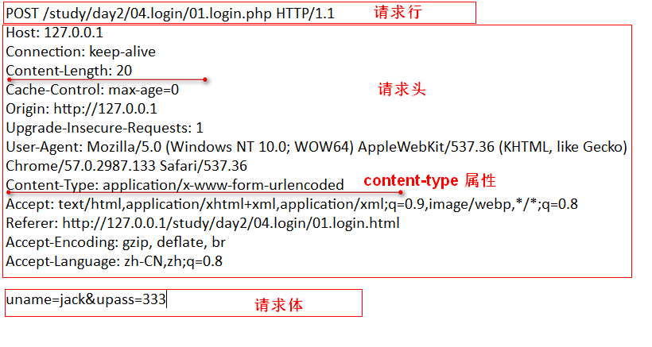
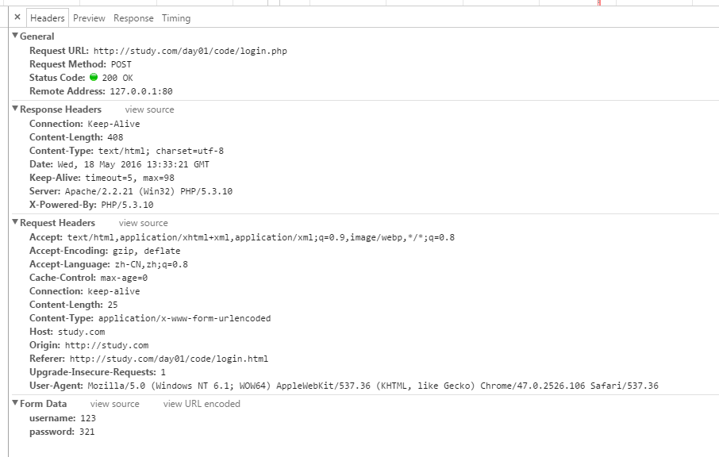
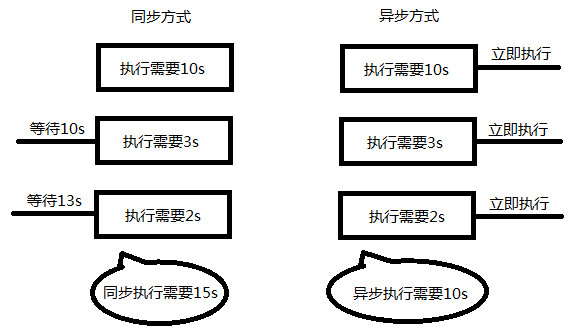
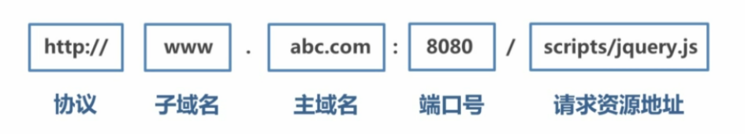

# http服务&ajax编程,请求和响应信息解析,json数据格式

## 1. 服务器

> 通俗的讲，能够提供某种服务的机器（计算机）称为服务器

### 1.2 服务器软件

> 使计算机能提供某种服务的应用软件，称之为服务器软件.
服务器通过安装相应的服务器软件，然后进行配置后就可以对外提供某种服务。

常见的服务器软件有：

-  文件服务器：Server-U、FileZilla、VsFTP等（FTP是File Transfer Protocol文件传输协议）；
-  数据库服务器：oracle、mysql、SQL server、DB2、ACCESS等；
-  邮件服务器：Postfix、Sendmail等；
-  **HTTP服务器**：Apache、Nginx、IIS、Tomcat、NodeJS等；


> 服务器想要对外提供什么服务，就安装相应的服务器软件。


### 1.3 服务器类型

按不同的划分标准，服务器可划分为以下类型：

-  按**软件功能类型**划分： 文件服务器、数据库服务器、邮件服务器、Web服务器等；
-  按**安装操作系统**划分： Linux服务器、Windows服务器等；
-  按**应用软件名称**划分： Apache服务器、Nginx 服务器、IIS服务器、Tomcat服务器、
   mysql服务器、oracle服务器、 Node服务器等；

> 本质：无论是按软件功能，还是安装的系统，或名称称呼,服务器的本质就是一台装了某款服务器软件的计算机。


### 1.4 HTTP服务器
> 即网站服务器，主要提供文档(文本、图片、视频、音频)浏览服务，通常会安装Apache、Nginx服务器软件。
  
HTTP服务器可以结合某一编程语言处理业务逻辑，由此进行的开发，通常称之为**服务端开发**。 
 
服务端的编程语言包括 php、java、.net、Python、Ruby、Perl等。  


### 服务器总结：
1. 服务器就是计算机，通过安装服务器软件，才能向外提供服务。
2. 根据服务器软件的功能，名称，安装的系统这些不同的标准，可以划分出不同类型的服务器。
3. HTTP服务器主要提供网站浏览服务，可以结合某编程语言进行开发，我们称之为服务器开发。

## 2、客户端

### 2.1 如何理解客户端?

* 客户端：电脑，手机，iPad平板安装了客户端软件，可以称之为客户端。
* 客户端：安装客户端软件，**索取服务**一方（向服务器获取）
* 服务端：安装服务端软件，**提供服务**一方（向客户端提供）


> 具有向服务器**索取服务**能力的终端，如比如 手机、电脑等
> 安装不同的客户端软件，可以获取不同的服务，比如通过QQ获得即时通讯服务、通过迅雷获得下载服务等。

### 2.5 CS/BS软件（了解）


|CS软件|CS软件|
|-|-|
|手机QQ，LOL游戏 , 手机微信	 | 网页QQ，新浪网站，网页地图 |
|||
|1. 需要安装，手机、电脑桌面应用 	|1. 不用安装，运行在浏览器网页应用 		|
|2. 性能更高效，更稳定，使用更流畅	|2. 性能相对较低，流畅性弱（依赖浏览器） |
|3. 开发及维护难度增大				|3. 开发维护相对更快					|
|4. 兼容各种系统平台				|4. 兼容浏览器						|


> CS 就是（client/server） 客户端+服务器 的应用
> BS 就是（browser/server） 浏览器+服务器 的应用( 一种特殊的CS 软件)
> 小结：CS手机电脑桌面用应，BS浏览器网页应用。


### 客户端总结：

1. 客户端就是手机，iPad平板，电脑，等智能设备，装有了客户端软件，可以获取服务器上的服务。
2. 服务器是提供服务一方，客户端是索取服务一方
3. 客户端通常按设备，系统划分，把浏览器中网页应用单独划分，则有了BS/CS应用之分。
4. 我们做的都是浏览器网页应用,都是BS架构.
5. 以浏览器为宿主环境,使用html,css,js技术的开发称为前端开发，需要后台开发人员配合。

## 3、网络基础 IP , 域名 , 端口, DNS服务.

### 3.2 IP地址

IP地址: 每个连接在互联网上的电脑主机在网络上的唯一标识（身份证，手机电话号码）

> 形式: 一个32位地址(192.168.10.100)
查看本机IP地址: ipconfig、ifconfig（linux,mac）
查看网站IP地址: ping  www.baidu.com


### 3.3 域名

由于IP地址基于数字，不方便记忆，于是便用域名来代替IP地址，域名是一个IP地址的“面具”  

> 形式: www.baidu.com
查看域名对应的IP地址: ping www.baidu.com


### 3.4 DNS服务

DNS（Domain Name System）网上作为域名和IP地址相互映射的一个分布式数据库，
它能够使用户更方便的通过域名形式访问网站。

> DNS服务器: 简单的说就是指记录IP地址和域名之间对应关系的服务器电脑。
  DNS寻址:先找本机hosts文件、再找DNS服务器( 专干对应域名IP的活 )
  刷新DNS： ipconfig /flushdns 


### 3.5 端口

端口号是计算机与外界通讯交流的出口，每个端口对应不同的服务。

> 查看端口占用情况： netstat -an
> 常见端口号 80、8080、3306、21、22


### 5.1 最简单的php程序

    
### 5.8、文件导入&&常用php函数

文件导入

include 和 require 导入文件

```php
	/*导入template.html文件*/
    include 'template.html';

	/*导入data.php文件*/
    require 'data.php'
```


## 6、网络传输协议

### 6.1、如何理解协议？


### 6.1、常见网络传输协议

> 网络传输协议：客户端与服务器端的约定。目的：传输信息，怎么传

```
HTTP、HTTPS 超文本传输协议 
FTP 文件传输协议
SMTP 简单邮件传输协议
```


    
### 6.2、http协议

```
超文本传输协议（HTTP，HyperText Transfer Protocol) 网站是基于HTTP协议的，
例如网站的图片、CSS、JS等都是基于HTTP协议进行传输的。
```

> http请求: 浏览器到服务器要文件或数据,服务器返回文件或数据的过程.
> http协议：浏览器和服务器的约定。要数据规范,和返回数据的规范.


#### 6.2.1、请求和请求报文

请求:由浏览器客户端发起
格式:请求行、请求头、请求主体。

- **1、请求行**
 
	> 由请求方式、请求URL和协议版本构成
	常用请求方法 **POST**、**GET**、PUT、DELETE

	```
	GET /day01/code/login.php?username=123&password=123 HTTP/1.1
	POST /day01/code/login.php HTTP/1.1
	```
- **2、请求头**
	> 注：当以post形式提交表单的时候，请求头里会设置
    Content-Type: application/x-www-form-urlencoded 告诉服务器提交的数据是何种类型

	```
	Host：127.0.0.1             请求的主机
	Cache-Control：max-age=0    控制缓存
	Accept：*/*                 接受的文档MIME类型
	User-Agent：                浏览器信息
	Referer：                   从哪个URL跳转过来的
	Accept-Encoding：           可接受的压缩格式
	If-None-Match：             记录服务器响应用于控制缓存 (是由服务器自动生成的)
	If-Modified-Since：         记录文件修改 (是由服务器自动生成的)
	```
	
- **3、请求主体**
	
	> 即传递给服务端的数据, 格式: name=value&age=18
	
	```
	post请求数据放在请求主体中
	get请求没有请求主体
	```


- **请求报文示例图**:
	> GET方式: 

	> POST方式: 

#### 6.2.2、 响应和响应报文

响应:由服务器端发起
格式:状态行、响应头、响应主体。

- **1、状态行**
 
	> 由协议版本号、状态码和状态信息构成
	> 状态码: 常见的有200代表成功、304文档未修改、403没有权限、404未找到、500服务器错误
	
	```
    HTTP/1.1 200 OK  
	```
	
	

- **2、响应头**
	> 响应的数据也有一个content-type属性,内容与我们设置的header()函数中的内容一致
	> 该函数用告诉浏览如何解释服务给把返回的数据.
	
	```
	Date：			响应时间
	Server：			服务器信息
	Last-Modified：	资源最后修改时间 由服务器自动生成
	ETag：			资源修改后生成的唯一标识由服务器自动生成
	Content-Length：响应主体长度
	Content-Type：	响应资源的类型
	```
- **3、响应主体**

	即服务端返回给客户端的内容；


- **响应报文示例图**

	> 响应报文不区分方式:
	>
	> 状态码值参考：
	> 


### 6.3 谷歌浏览器中查看请求报文与响应报文

步骤：f12开发者工具 ---> Network ---> All




## 7 AJAX编程


> 问:什么是ajax,有什么作用?
> 答:
 1. 英文: Asynchronous Javascript And XML
 2. AJAX 是一种通信技术简称,并不是一门的新的语言，而是对现有技术的综合利用。
 3. 本质:是在HTTP协议的基础上以异步的方式与服务器进行通信。
 4. 作用:实现浏览器和服务器之间异步交换数据.


### 7.1  异步&同步


如何理解同步和异步概念?
```
- 同步: 指的就是事情要一件一件做。等做完前一件才能做后一件任务
- 异步: 不受当前任务的影响，两件事情同时进行，做一件事情时，不影响另一件事情的进行。
```



> 异步在编程中体现: 异步程序代码执行时不会阻塞其它程序代码执行,从而提升整体执行效率。

```
网页异步应用案例：
1. 验证你的用户名是否已经存在（一边输入，一边获取你的信息，和后台比对）。
2. 百度搜索提示，及相关内容展示（一边输入，一边找出了你可能要的内容）。
3. 新浪微博自动加载（一边滚动，一边加了新的一页数据给你）。
```


> 问: 在js中如何书写异步程序?
> 答: 在js中可以用 XMLHttpRequest 书写异步的处理程序。
> 问: 使用该对象像书写的程序有什么优点
> 答: 我们便可实现对网页的部分更新，而不是刷新整个页面

### 7.2、 XMLHttpRequest


使用XMLHttpRequest示例:

```javascript

/*javascript内置的http请求对象  XMLHttpRequest*/

/*1.初始化对象*/
var xhr = new XMLHttpRequest;

/*2.设置请求报文*/

/*请求的行*/
xhr.open('post','01.php');

/*请求头*/
/*get 没有必要设置*/
/*post必须设置 Content-Type: application/x-www-form-urlencoded */
xhr.setRequestHeader('Content-Type','application/x-www-form-urlencoded');

/*请求主体,并发出请求*/
xhr.send("name=xjj&age=10");

```

#### 7.2.1、请求代码

> HTTP请求3个组成部分（请求报文）与XMLHttpRequest方法的对应关系

**注意书写顺序**
```javascript
1. 请求行
xhr.open('post','01.php');

2. 请求头 ,get请求可以不设置
xhr.setRequestHeader('Content-Type','application/x-www-form-urlencoded');

3. 请求主体 ,get请求传null 
xhr.send("name=xjj&age=10");
``` 
    

    
    
#### 7.2.2、响应代码

> 因为服务器做出响应需要时间（比如网速慢等原因），所以我们需要等整个请求响应过程完成后，然后才能进行接收响应的内容。


**onreadystatechange 监听请求响应事件  readyState 状态**

> onreadystatechange：是监听整个请求响应过程,会被多次触发.
> readyState： 记录XMLHttpRequest对象,当前的工作状态.

```javascript
0：请求未初始化（还没有调用 open()）。  
1：请求已经建立，但是还没有发送（还没有调用 send()）。  
2：请求已发送，正在处理中（通常现在可以从响应中获取内容头）。  
3：请求在处理中；通常响应中已有部分数据可用了，但是服务器还没有完成响应的生成。  
4：响应已完成；您可以获取并使用服务器的响应了。

/*其实我们只关心请求完成后的事*/
if(xhr.readyState == 4 ){
    console.log('响应已完成');
}
```


> HTTP响应3个组成部分（响应报文）与XMLHttpRequest方法或属性的对应关系。

```javascript
1. 获取状态行（包括状态码&状态信息）
xhr.status 状态码
xhr.statusText 状态码信息

2. 获取响应头
xhr.getResponseHeader('Content-Type');
xhr.getAllResponseHeaders();

3. 响应主体   
xhr.responseText
xhr.responseXML

```  


    
#### 7.3.3 API详解

    xhr.open() 					//发起请求，可以是get、post方式
    xhr.setRequestHeader()		//设置请求头
    xhr.send() 					//发送请求主体，get方式可传null

    xhr.onreadystatechange = function () {}  		//监听请求响应过程状态
	xhr.readyState 				//记录请求响应过程状态

    xhr.status					//表示响应状态码，如200
    xhr.statusText				//表示响应状态信息，如OK
    xhr.getAllResponseHeaders() 		//获取全部响应头信息
    xhr.getResponseHeader('key') 		//获取指定头信息
    xhr.responseText、			//以普通网页字符串形式,接收响应主体
	xhr.responseXML				//以xml文档形式,接收响应主体
 
我们需要检测并判断响应头的MIME类型后确定使用request.responseText或者request.responseXML


 注：GET和POST请求方式的差异（面试题）
 
 1. GET没有请求主体，使用xhr.send(null)
 2. GET可以通过在请求URL上添加请求参数
 3. POST可以通过xhr.send('name=itcast&age=10')传数据
 4. POST需要设置content-type属性.
 5. GET效率更好（应用多）
 6. GET大小限制约4K，POST则没有限制
 
### 7.5  JSON

即 JavaScript Object Notation，另一种**轻量级**的文本数据交换格式，**独立于语言**,取值更方便。

1. 数据在名称/值对中  
2. 数据由逗号分隔(最后一个健/值对不能带逗号)  
3. 花括号保存对象，方括号保存数组  
4. 键值都要使用双引号  
5. 文件中不能写注释

```json
[
  {"src":"images/detail01.jpg","oldPrice":"10.12","newPrice":"130.00"},
  {"src":"images/detail02.jpg","oldPrice":"1.00","newPrice":"11.00"},
  {"src":"images/detail03.jpg","oldPrice":"100.00","newPrice":"1000.00"}
]
```


JSON数据在不同语言进行传输时，类型为字符串，不同的语言各自也都对应有解析方法，需要解析完成后才能读取

** Javascript 解析方法**  

JSON对象  

* JSON.parse() ：将json格式字符串 转化成 javascript数组、对象
* JSON.stringify()：将javascript数组、对象 转化成 json格式字符串 

```javascript 

/*声明数组对象*/
var products = [
     {
         src:'images/detail01.jpg',
         oldPrice:'120',
         nowPrice:'90'
     },
     {
         src:'images/detail02.jpg',
         oldPrice:'120',
         nowPrice:'90'
     },
     {
         src:'images/detail03.jpg',
         oldPrice:'120',
         nowPrice:'90'
     }
];

/*javascript: JSON.stringify 将js对象转为json格式字符串*/
var obj2str = JSON.stringify(products)
console.log(obj2str);
console.log(typeof obj2str);

/*javascript: JSON.parse 将js对象转为json格式字符串*/
var str2obj = JSON.parse(obj2str);
console.log(str2obj);
console.log(typeof str2obj);

```

> 注意: 如果要兼容老版本浏览器,可使用json2.js 文件 
总结：JSON体积小、解析方便且高效，在实际开发成为首选。


### 7.6、 xhr对象兼容性

**关于IE的兼容方面，了解即可。**

```javascript
function XHR() {
    var xhr;
    try {
        xhr = new XMLHttpRequest();
    }
    /*如果 try内的程序运行错误  抛出异常  捕捉异常  上面程序当中运行的错误*/
    catch(e) {
        /*在不同的IE版本下初始  ActiveXObject  需要传入的标识*/
        var IEXHRVers =["Msxml3.XMLHTTP","Msxml2.XMLHTTP","Microsoft.XMLHTTP"];

        for (var i=0;i<IEXHRVers.length;i++) {
            try {
                xhr = new ActiveXObject(IEXHRVers[i]);
            }
            catch(e) {
                /*如果出现错误的时候  停止当次的循环*/
                continue;
            }
        }
    }
    return xhr;
}
```


### 7.7  封装ajax工具函数

**目的：不想做重复的工作，书写重复代码。***

分析使用步骤:
```
1. 建立XMLHttpRequest对象
2. 使用open方法设置交互的基本信息,打开和服务器连接
3. 使用send方法设置发送，开始和服务器端交互
4. 注册状态监听的onreadystatechange回调函数 
```
**封装步骤**

步骤1：分析参数（提取会变的为参数）
```
* 请求方式
* 请求地址
* 是同步还是异步
* 传递的数据
* 响应成功处理函数
* 响应失败的处理函数
```

步骤2：利用对象优化参数
```
function ajax(type,url,data,success){
	//这种写法不好，参数固定，要记忆参数顺序和类型。不方便后期的使用
	console.log(type);
	console.log(url);
}

function ajax(options){
	// 优势：不再关注参数的顺序，方便参数类型和顺序的扩展
	console.log( options.type );
	console.log( options.url );
}
```

步骤3：处理POST与GET差异
```
* POST数据不放在URL上，GET请求数据添加在URL后面
* POST请求必须要设置Content-type属性，GET请求则可以省略
* POST请求体放在Send方法里。而GET没有请求体可以设为null
```

步骤4：命名空间使用，不和其他人封装的函数起冲突（被覆盖）

**封装示例代码**
```javascript 
/**
 * 封装ajax工具方法
 */

/**
 * 第1步：分析参数
 * 
 * 主要的参数       参数名       类型          默认值            取值范围 
 * 1.请求方式       type        字符串         get             get/post
 * 2.请求地址       url         字符串         当前地址         后台处理的文件
 * 3.传递的数       data         对象          {}               {name:jack,age:18}   ===> name&jack&age=18
 * 4.是否异步       async       布尔值         true            true/false
 * 
 * 响应
 * 6.成功回掉       success     函数          -             响应成功后如何处理数据
 * 7.失败回掉       error       函数          -             响应失败后如何处理
 * 
 */


/**
 * 第2步：优化传参   
 * 
 * 要记忆参数顺序，调用麻烦
 * function ajax(type,url,data,async,success,eror){}    
 *   
 * function ajax(options){}                 
 * 
 * var options = {
 *      type:'get',
 *      url:'xx.php'
 *      success:function(){}
 * }
 * 
 * ajax(options)
 */


/**
 * 第3步：处理get和post差异，开始封装 
 */

function ajax(options){

    /*如果用户没有传参则返回*/
    if(!options || tyepof options !== "object" ){
        return false;
    }

    /*处理参数为空情况*/
    var type  = options.type === 'post' ? 'post' : 'get' ;
    var url   = options.url || location.pathname;   //给当前路径
    var data  = options.data || {};
    var async = options.async === false ? false : true;

    /*把对象参数转成字符串*/
    var dataStr = ''; 
    for( key in data ){
        dataStr += key + "=" + data[key] + "&";
    }
    dataStr = dataStr.slice(0,-1);
    //console.log(dataStr);


    var xhr = new XMLHttpRequest();

    /*处理get和post请求差异*/
    if(type === 'get'){
        xhr.open(type,url + "?" + dataStr ,async);
        xhr.send(null);
    } else {
        xhr.open(type,url,async);
        xhr.setRequestHeader('content-type','application/x-www-form-urlencoded');
        xhr.send(dataStr);
    }

    /*注册请求响应监听事件*/
    xhr.onreadystatechange = function(){
        /*响应完成*/
        if(xhr.readyState == 4 ){
            /*响应成功*/
            if(xhr.status == 200 ){

                /*根据响应头的content-type属性指定方法接收到的内容*/
                var contentType = xhr.getResponseHeader('content-type');
                var data = null;
                if(contentType.indexOf('json') > -1){
                    data = JSON.parse(xhr.responseText);
                } else if(contentType.indexOf('xml') > -1) {
                    data = xhr.responseXML;
                } else {
                    data = xhr.responseText;
                }
                /*执行成功函数*/
                options.success && options.success(data);
            } else {
            /*响应失败*/
                options.error && options.error(xhr.statusText);
            }
        }
    }

}


/**
 * 第4步：利用命名空间防止冲突
 */

window.itcast = {
    ajax:function(options){
        //console.log('myajax');

        /*如果用户没有传参则返回*/
        if(!options || tyepof options !== "object"  ){
            return false;
        }

        /*处理参数为空情况*/
        var type  = options.type === 'post' ? 'post' : 'get' ;
	    var url   = options.url || location.pathname;   //给当前路径
	    var data  = options.data || {};
	    var async = options.async === false ? false : true;

        /*把对象参数转成字符串*/
        var dataStr = ''; 
        for( key in data ){
            dataStr += key + "=" + data[key] + "&";
        }
        dataStr = dataStr.slice(0,-1);
        //console.log(dataStr);


        var xhr = new XMLHttpRequest();

        /*处理get和post请求差异*/
        if(type === 'get'){
            xhr.open(type,url + "?" + dataStr ,async);
            xhr.send(null);
        } else {
            xhr.open(type,url,async);
            xhr.setRequestHeader('content-type','application/x-www-form-urlencoded');
            xhr.send(dataStr);
        }

        /*注册请求响应监听事件*/
        xhr.onreadystatechange = function(){
            /*响应完成*/
            if(xhr.readyState == 4 ){
                /*响应成功*/
                if(xhr.status == 200 ){

                    /*根据响应头的content-type属性指定方法接收到的内容*/
                    var contentType = xhr.getResponseHeader('content-type');
                    var data = null;
                    if(contentType.indexOf('json') > -1){
                        data = JSON.parse(xhr.responseText);
                    } else if(contentType.indexOf('xml') > -1) {
                        data = xhr.responseXML;
                    } else {
                        data = xhr.responseText;
                    }
                    /*执行成功函数*/
                    options.success && options.success(data);
                } else {
                /*响应失败*/
                    options.error && options.error(xhr.statusText);
                }
            }
        }

    }
}

```


### 7.8  jquery的ajax
jQuery Ajax介绍 [w3school网站](http://www.w3school.com.cn/jquery/jquery_ref_ajax.asp)
> jQuery为我们提供了更强大的Ajax封装,工作中我们更多的是使用这些已经封装好ajax方法.

掌握的几个方法:

- $.ajax({}) 可配置方式发起Ajax请求
- $.get() 以GET方式发起Ajax请求
- $.post() 以POST方式发起Ajax请求
- $('form').serialize() 序列化表单（即格式化key=val&key=val）

$.ajax方法常用参数：
	```
	url 接口地址
	type 请求方式
	timeout 请求超时
	dataType 服务器返回格式
	data 发送请求数据
	beforeSend: function () {} 请求发起前调用
	success 成功响应后调用
	error 错误响应时调用
	complete 响应完成时调用（包括成功和失败）
	```

**具体参考代码**


## 8、模版引擎

> 为什么要学习模板引擎?


### 8.1、什么是模板引擎？ 

> 一个帮助我们把数据渲染成图形的界面的工具。


常见的模板插件

* BaiduTemplate(百度开发) 
* artTemplate(腾讯开发) 
* velocity.js(淘宝开发) 
* Handlebars


> 模板引擎的用法大同小异,ArtTemplate由于性能优秀,这里我们演示ArtTemplate的用法


### 8.2、 artTemplate 简介语法模板


**使用步骤：**

1、导入模板引擎: 将下载好的ArtTemplate导入到页面中
 
	<script src="./js/template.js"></script>

2、定义模板:

注意:这路的模板type='text/html'如果写成javascript会执行

	<script id="template" type="text/html">
	    <h2>姓名：{{name}} </h2>
	    <h2>年龄：{{age}}  </h2>
	    <h2>技能：{{skill}} </h2>
	</script>


3、渲染模板: 我们可以使用template(模板id,数据) 执行替换了;

	//数据
    var data = {
        name:'小明',
        age:18,
        skill:'快速打代码'
    };

    
    //模板渲染数据
    var tplstr = template('template',data);
    document.querySelector('div').innerHTML = tplstr;
    


**模板逻辑语法：**

 each语法:

	<script src="./js/template.js"></script>

	<script id="template" type="text/html">
	    {{ each list }}
	    <tr>
	        <td>{{$index+1}}</td>
	        <td>{{$value.url}}</td>
	        <td>{{$value.nowPrice}}</td>
	        <td>{{$value.oldPrice}}</td>
	    </tr>
	    {{/each}}
	</script>

	<script>
	    var data = [
            {
                "url":"images/detail01.jpg",
                "nowPrice":"10.00",
                "oldPrice":"100.00"
            },
            {
                "url":"images/detail01.jpg",
                "nowPrice":"10.00",
                "oldPrice":"100.00"
            },
            {
                "url":"images/detail01.jpg",
                "nowPrice":"10.00",
                "oldPrice":"100.00"
            }
        ];

        var html = template('template',{list:data});
	    document.querySelector('tbody').innerHTML = html
	</script>

if 语法:
	
	
	<script src="./js/template.js"></script>

	<script id="template" type="text/html">
	    <h3>{{name}}
	    {{if isMan }}
	        兄弟,你好
	    {{ else }}
	        妹子,你好
	    {{/if}}
	    </h3>
	    <h3>你今天吃益达了嘛。</h3>
	    <hr>
	</script>
	
	<script >
	    var person = {
	        name:'小明',
	        isMan:true
	    };
	    var person2 = {
	        name:'小红',
	        isMan:false
	    };
	    document.querySelector('input[type="button"]').onclick = function(){
	        var html1 = template('template',person);
	        document.querySelector('#template').innerHTML = html1;
	
	        var html2 = template('template',person2);
	        document.querySelector('#template').innerHTML += html2;
	    }
	</script>


### 8.3 模板引擎实现原理


> 模版引擎做了什么事情,替换数据实现的流程是如何实现的? 

- 假定js中有如下数据：
```
var obj = {
	name:"大雄",
	age:13,
	skill:"呼叫哆拉A梦"
};
```
- 希望渲染为这样的界面：
``` 
<div>姓名:大雄</div>
<div>年龄:13</div>
<div>技能:呼叫哆拉A梦</div>	 
```
- 解决办法：
```
<div>姓名:{{ name }}</div>
<div>年龄:{{ age }}</div>
<div>技能:{{ skill }}</div>
```	
> 1.定义这样一个模板，把要显示数据的位置用 {{ 属性名 }}部分占位。
> 2.写一个函数，读取模板--->找到占位的坑--->传入对象替换--->返回html代码 


实现方法：

1. 我们定义一段文本作为模板,读取文本,使用特殊的符号{{ 属性名 }}占位
2. 通过正则表达式找到这些特殊的符号进行替换,是不是就实现了?

** 自定义模板引擎(理解) **

	 function mytemplate(id,data){
		//1.获取模板字符串
	 	var tmpl = document.querySelector('#'+id).innerHTML;
	 	//2.查找里面的字符串 {{}}
	 	var re = /{{(\w+)}}/; 
	 	var result = null;
	 	//3.当还有值就替换
	 	while(result = re.exec(tmpl)){
	 		tmpl = tmpl.replace(result[0],data[result[1]]); //替换后重新赋值
	 	}
	 	return tmpl
	 }


## 10、同源&跨域

### 10.1 同源


什么是同源，同源政策？

网址组成:一个网页地址通常有协议，子域名，主域名，端口，请求资源地址，共同组成。
> 

同源：两个网页**域名，协议，端口**完全相同。
同源政策：当两个网页，域名，协议，端口任何一个不同时，就会有一些限制,是浏览器的一种安全策略。
同源政策目的：是为了保证用户信息的安全，防止恶意的网站窃取数据。

跨域: 两个网页**域名，协议，端口**任何一个不同,(即不同源我们称之为跨域)
跨域访问:而突破绕过这些限制，在两个页面之间进行访问，我们称为跨域访问。


```
网页A网址：
http://www.example.com/index.html

网页B地址：										
	网页A网址：
	http://www.example.com/index.html
 
	访问网页B：									
	http://www.baidu.com/server.php             域名不同
	http://api.example.com/server.php           子域不同	
	https//www.example.com/server.php           协议不同		
	http://www.example.com:8080/server.php      端口不同		
	http://192.168.10.78.com/server.php         IP

	http://www.example.com/detail.html          文件不同
	http://www.example.com/home/category.html   目录不同
```

限制范围(非同源)：

- 无法共享 cookie, localStorage, indexDB
- 无法操作彼此的 dom 元素
- 无法发送 ajax 请求
- 无法通过 flash 发送 http 请求

> 如果浏览器没有这些限制会怎么样呢？


###10.2	跨域

> 同源策略做了很严格的限制，但是在实际的场景中，又确实有很多地方需要突破同源策略的限制，也就是我们常说的跨域

跨域: 两个网页**域名，协议，端口**任何一个不同,(即不同源我们称之为跨域)
跨域访问：不同源网页之间,访问获取传递数据.

可跨域访问的标签
```
link,
iframe
img
script
```


### 10.3  jsonp 

> 英文名: JSON with Padding

** 原理剖析**


> 其本质是利用了`<script src=""></script>`标签具有可跨域的特性
由服务端返回一个预先定义好的Javascript函数的调用，并且将服务器数据以该函数参数的形式传递过来，此方法需要前后端配合完成。


html页面：
```
<!-- 当我们用script标签去加载的时候  会把内容解析成js去执行 -->

<script>
     //1.我们先定义一个函数
 	function myfoo( jsonpData ){
 		//内部如何使用就是我们自己定的了。
 		console.log(jsonpData);
 	}
 </script>

 <!-- 2.利用script标签的src属性请求并执行调用-->
 <script src="http://api.study.php?callback=myfoo"></script>

```

后台php页面：

```
<?php
 	//接收传递过来的函数名
 	$name = $_GET['callback']; 

 	//转为数组为json格式数据
 	$arr = array("小李飞","大张伟");
 	$jsonData = json_encode($arr);

 	//返回函数名称的调用。
 	echo $name."(".$jsonData.")";
?>
```

###10.4 CORS 跨域

> 服务端设置响应头实现跨域
1. ` header('Access-Control-Allow-Origin: *'); `,
2. `header('Access-Control-Allow-Origin', origin);`
3. `header('Access-Control-Allow-Headers', 'Origin, X-Requested-With, Content-Type, Accept, token');`
4. `header('Access-Control-Allow-Credentials', true) ;`
5. `header('Access-Control-Allow-Methods', 'GET, POST, PUT, OPTIONS, DELETE') ;`


html页面：
```
//在jquery中跨域
$.ajax({
    type:'post',
    url:'http://api.study.com/post.php',
    data:{
        name:'汤姆'
    },
    dataType:'json',
    success:function(data){
        console.log(data);
    }
})
```
后台php页面
```
/*允许所有的跨域请求*/
//header('Access-Control-Allow-Origin:*');

/*也可以显示某一个具体的来源可以访问*/
header('Access-Control-Allow-Origin:http://www.study.com');

$arr = array(
    'name'=>$_POST['name']
);

echo json_encode($arr);
```

优点： get 和 post请求都能发送


###10.5  跨域方案（了解）

> 以下方式基本不用啊，了解即可：

```
1. 顶级域名相同的可以通过domain.name来解决，即同时设置 domain.name = 顶级域名（如example.com）  
2. document.domain + iframe  
3. window.name + iframe  
4. location.hash + iframe  
5. window.postMessage()  
参考资料
http://rickgray.me/2015/09/03/solutions-to-cross-domain-in-browser.html
```
